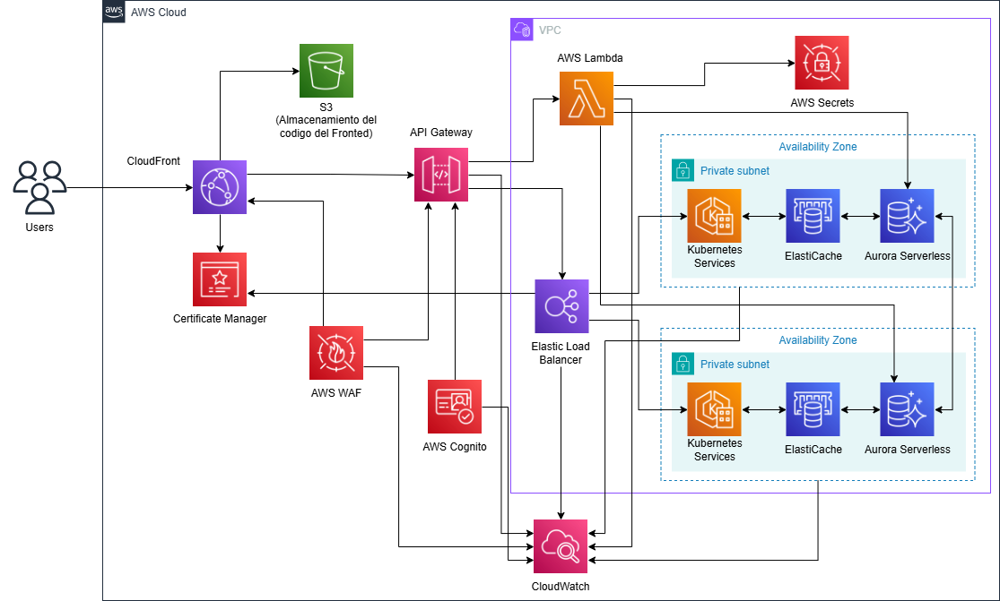

# PROPUESTA TÉCNICA E-COMMERCE JFC

---

## 👤 Presentación

**Nombre:** Sebastián Largacha  
**Profesión:** Analista de CloudOps (AWS) 
**Teléfono:** 312 728 4537  
**Correo electrónico:** chitas1004@hotmail.com

Analista de CloudOps con experiencia en diseño, automatización y operación de arquitecturas en la nube sobre Amazon Web Services (AWS), enfocado en soluciones escalables, seguras y optimizadas en costos, alineadas a buenas prácticas de arquitectura cloud.

---

## 📋 Contexto

La empresa JFC requiere una plataforma tecnológica tipo e-commerce moderna que permita soportar una aplicación web con alta disponibilidad, escalabilidad automática, seguridad robusta y costos controlados.

El entorno debe ser capaz de:

• Atender picos variables de tráfico sin degradar el rendimiento.  
• Garantizar alta disponibilidad de los servicios críticos.  
• Reducir la carga operativa mediante servicios administrados.  
• Optimizar costos  
• Garantizar seguridad

Adicionalmente, se requiere que la infraestructura pueda ser reproducible, automatizada y fácil de mantener, alineándose con prácticas modernas de Infraestructura como Código (IaC) y CI/CD.

---

## 🏗️ Arquitectura Propuesta

La arquitectura propuesta está basada completamente en servicios administrados de AWS y sigue un enfoque desacoplado y altamente disponible.

A alto nivel, la solución contempla:

• Distribución global de contenido y protección perimetral.  
• Capa de autenticación y control de acceso.  
• Backend basado en contenedores orquestados y funciones lambda.  
• Servicios de datos altamente disponibles y escalables.  
• Observabilidad centralizada y operación controlada.

### - Diagrama de Arquitectura

### - Descripción General

Los usuarios acceden a la aplicación a través de Amazon CloudFront, que distribuye el contenido del frontend almacenado en Amazon S3, mejorando la latencia y la experiencia del usuario.

Las solicitudes API son gestionadas por Amazon API Gateway, el cual integra mecanismos de autenticación con Amazon Cognito y protección mediante AWS WAF.

El tráfico backend es dirigido a un Application Load Balancer, que distribuye las solicitudes hacia un clúster de Amazon EKS desplegado en subredes privadas y distribuido en múltiples Zonas de Disponibilidad y funciones lambda para operaciones del negocio ligeras.

Los servicios internos consumen datos desde Amazon ElastiCache para optimizar tiempos de respuesta y desde Amazon Aurora Serverless para persistencia de datos, garantizando escalabilidad automática y alta disponibilidad.

Los secretos y credenciales son gestionados de forma segura mediante AWS Secrets Manager, y toda la solución es monitoreada centralmente con Amazon CloudWatch.

---

## ⚙️ Infraestructura como Código (IaC)

La automatización de la infraestructura se realizó utilizando Terraform, permitiendo definir, versionar y desplegar todos los recursos de AWS de forma declarativa.

Las plantillas de Terraform:

• Permiten la creación consistente de los entornos.  
• Facilitan la replicabilidad entre ambientes (desarrollo, pruebas, producción).  
• Reducen errores manuales en el aprovisionamiento.  
• Aseguran que la infraestructura pueda ser reconstruida o modificada de forma controlada.

Las plantillas desarrolladas se entregan como anexo a este documento, asegurando que sean reutilizables, parametrizables y alineadas con buenas prácticas de IaC.

---

## 🔄 Integración Continua y Entrega Continua (CI/CD)

La propuesta cuenta con una plantilla de Integración Continua y Entrega Continua (CI/CD) basada en GitHub Actions, la cual permite automatizar de forma segura y controlada el despliegue tanto de la infraestructura.

Esta estrategia asegura:

• Despliegues reproducibles y confiables.  
• Mayor velocidad de entrega sin comprometer la estabilidad.  
• Mayor seguridad al automatizar el despliegue evitando errores humanos

La plantilla de despliegue de GitHub Actions se entrega como anexo a este documento.

---

## 💰 Estimación de Costos

Se realizó una estimación de costos optimizada utilizando la herramienta AWS Pricing Calculator, considerando:

• Uso de servicios administrados para reducir costos operativos.  
• Escalabilidad automática para evitar sobredimensionamiento.  
• Selección de tipos de instancias adecuados a la carga esperada.  
• Uso eficiente de caché y distribución de contenido.

La estimación se encuentra anexa a este documento y busca un equilibrio entre rendimiento, disponibilidad y control de costos, permitiendo que la solución crezca de manera progresiva según la demanda real del negocio.

---

## 🚀 Disponibilidad y Rendimiento

La arquitectura garantiza alta disponibilidad y rendimiento mediante:

• Distribución Multi-AZ del clúster de Amazon EKS.  
• Application Load Balancer para balanceo de carga a nivel de aplicación.  
• Autoescalado de los servicios de Kubernetes.  
• Amazon Aurora Serverless, que escala automáticamente la capacidad de la base de datos.  
• Amazon ElastiCache, reduciendo la carga sobre la base de datos y mejorando los tiempos de respuesta.  
• Amazon CloudFront, optimizando la entrega de contenido a nivel global.

---

## 📊 Observabilidad

La observabilidad de la plataforma se logra mediante Amazon CloudWatch, el cual permite:

• Recolección centralizada de métricas de infraestructura y servicios.  
• Monitoreo de logs de aplicaciones y servicios.  
• Visibilidad del estado del clúster EKS y sus componentes.  
• Soporte para análisis y troubleshooting operativo.

Esto facilita una operación proactiva y una rápida respuesta ante eventos.

---

## 🛠️ Gestión y Operación

La operación de la solución se simplifica gracias a:

• Uso de servicios administrados (EKS, Aurora Serverless, ElastiCache).  
• Automatización de la infraestructura con Terraform.  
• Centralización de monitoreo y logs en CloudWatch.  
• Separación clara entre capas (frontend, backend, datos).  
• Despliegues controlados mediante GitHub Actions.

Este enfoque reduce la carga operativa y mejora la mantenibilidad del sistema.

---

## 🔒 Seguridad

La seguridad está integrada en todas las capas de la arquitectura:

• AWS WAF para protección contra ataques web comunes.  
• Amazon Cognito para autenticación y gestión de identidades.  
• AWS Certificate Manager para certificados SSL/TLS.  
• Subredes privadas para los servicios backend.  
• AWS Secrets Manager para gestión segura de credenciales.

La solución sigue el principio de defensa en profundidad y mínimo privilegio.

---

## ✅ Conclusión

La arquitectura propuesta cumple con los requerimientos de la solicitud de propuesta, proporcionando una solución segura, escalable, altamente disponible y optimizada en costos.